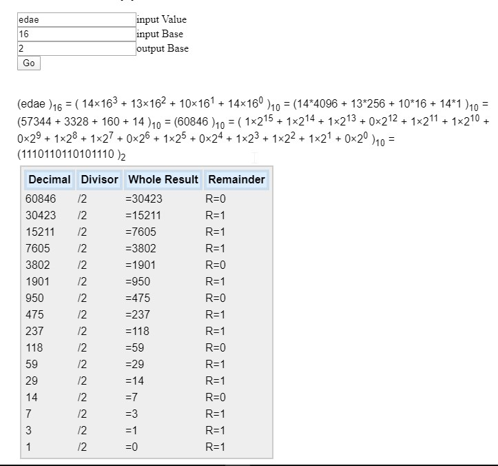

> **BASE CONVERTER**
>
> **Show manual calculation, long division and math included**

Hey, as you know, it may be hard to prepare on exams truly, if what they
demand from you is not exactly available on the internet toolkit.

 All those online binary converters seem to forget that what counts for
education is understanding of the process, not jumping to the result. If
what we need is just the conversion output computers do it already
perfectly behind the scenes.

 If, however the **desire is to learn why it is the case** that

C0FFEE is 12648430
Or why 5 is represented as 101 in binary?

**Guess what? You are in the right place.**

 

 Most of computer science courses expects students to calculate binary
conversions manually, performing long division and presenting
calculations including mathematic formulae.

For this reason, I build the tool that helps you target those small
mistakes exactly, up to the exact line of calculation. Additionally, you
can learn better.

